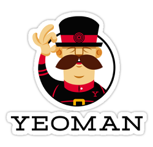

# Build your own AddOn

ShareCoffee is of course offering an entire wrapper for all REST services SharePoint is currently offering, but on top of that you could also provide custom Add-Ons. When talking about Add-Ons, two different kinds of Add-Ons have to be mentioned. First, there are Add-Ons covering dedicated services such as ShareCoffee.Search or ShareCoffee.UserProfiles. This kind of Add-Ons are providing dedicated helpers and time-savers for a given service hosted by SharePoint or SharePoint Online.

On the other side, there are Domain Add-Ons. Domain Add-Ons are providing a special kind of programming interface for an already given endpoint in SharePoint. For example consider you’re writing multiple apps offering task management, by providing a ‘ShareCoffee.TaskService’ Add-On, you can easily reduce the amount of code to write within each of these apps.

## AddOn Development Stack

If you aren’t familiar with the [yeoman](http://yeoman.io) frontend development workflow, you should consider reading the tutorial on it’s website. Yeoman is a productivity boost for every web developer and makes creating new Web-Apps very easy.

ShareCoffee’s Add-Ons are based on a special yeoman generator. Generators for yeoman are small templates that define how a new project based on this generator will look like. The generator-sharecoffee-addon is responsible for pulling all the development dependencies from the web and installing them on your development machine. Most important to know about yeoman is the fact that it’s based on [Node.JS](http://nodejs.org), so you can create new ShareCoffee Add-Ons from almost every device.

## Installing Yeoman and the Add-On Generator

Installing Node.JS is fairly simple and will not be covered here. Check the web for thousands of articles describing how to install Node.JS on your operating system.
With a valid Node.JS installation you’ll also have access to the Node Package Manager (called npm). Yeoman and it’s generators have to be installed globally, therefor you need to have administrative (or root) permissions in order to install the required packages on your system. Actually installing yeoman is just a single command.

    npm install -g yo

When executing this command npm will check your system and install all the dependencies currently not installed on your system. Yeoman itself is offering nothing without it’s generators therefor let’s install the `generator-sharecoffee-addon` by executing

    npm install -g generator-sharecoffee-addon

## The MyFirstAddOn AddOn
At this point you’re able to start with your new Add-On. So let’s create a new directory for our Add-On

    #go to your development folder
    #on a Mac this will look like this

    cd ~/dev/

    #on a Windows machine it'll look like this
    cd /c/dev/

    mkdir MyFirstAddOn
    cd MyFirstAddOn

    # now let's use yeoman for scaffolding the entire AddOn by executing
    yo sharecoffee-addon

The generator will be invoked and it’ll ask you a few questions about your new Add-On, it’s important to provide real answers here, because yeoman is heavily using template generators in order to save your time.

Again it’ll pull down all the project related dependencies and install them in the scope of the current project. You’ll receive the following files and folder structure within the `MyFirstAddOn` folder

What are all these files and folder? Well, all these files and folders form up an increadible development stack. See this list of folders and their responsibility

|Folder|Responsibility|
|------|--------------|
|src|all your AddOn source have to be located in this folder|
|test|all unit-tests belong to this folder|
|bower_components|Installed client side dependencies|
|dist|Will contain the compiled AddOn|
|license|Contains a license file for your AddOn|
|docs|Will contain a complete documentation (annotated source) for your AddOn|
|node_modules|Contains all the dependencies for development time|
|nuget|Will contain generated nuget packages|

There are also a ton of files, which ones should you care about? Check this list

|File|Responsibility|
|----|--------------|
|.editorconfig|Many editors and IDE's provide an EditorConfig AddOn, which takes care about tabs, spaces and indentions (this makes team-development more easy)|
|.gitignore|defines common files which should not be stored in source control|
|.jshintrc| JS hint configuration|
|bower.json|defines clientside dependencies for bower.io|
|Gruntfile.coffee|The most important file! This file describes all the available grunt tasks (next section) which can be invoked from command line in order to invoke common tasks|
|package.json|defines all the dependencies for development time|
|Readme.md|This is just a simple readme (will provide a nice description site on github for example)|
|readme.txt|When installing your AddOn using NuGet in Visual Studio, this readme will automatically be opened|
|ShareCoffee.MyFirstAddOn.nuspec|NuGet package specification file|

`Gruntfile.coffee` defines some jobs that can be invoked using `grunt-cli`. See the following list of available commands.

|Command|Action that will be executed|
|-------|----------------------------|
|build(default)|Runs all unit tests, updates the documentation, compiles CoffeeScript to JavaScript, Minifies all the JavaScript, generates the NuGet Package as specified in the NuSpec file|
|test|Runs all the unit tests|
|docs|Updates the documentation|

Each of these commands can be invoked by piping it as first argument to the **grunt** executable.

    # build the AddOn
    grunt build
    # or (because it's the default task)
    grunt

    # only run unit tests
    grunt test

    # only update the docs
    grunt docs

By default the AddOn generator also provide some sample code and a sample UnitTest for you. Just review the source file at `src/ShareCoffee.MyFirstAddOn.coffee` and check out the sample UnitTest at `test/ShareCoffee.MyFirstAddOn.tests.coffee`.
